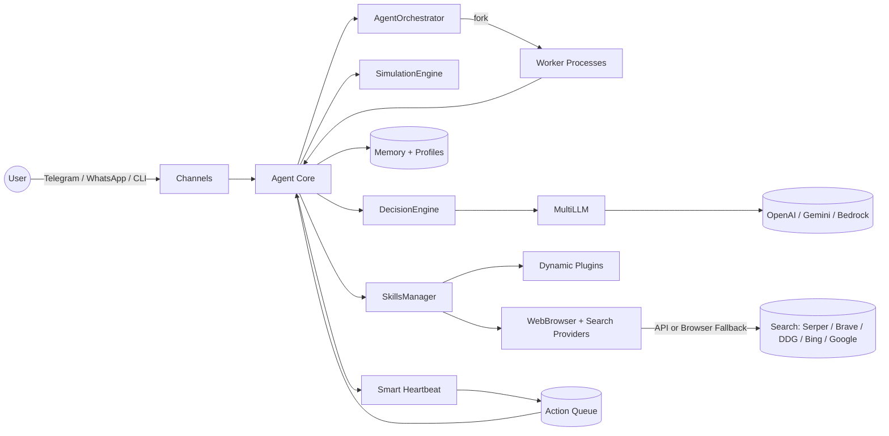

<div align="center">


# OrcBot v2.0
### The Production-Ready Strategic AI Agent
#### High-Power Intelligence with Web, Shell, and Strategic Simulation

[](https://opensource.org/licenses/MIT)
[](https://www.typescriptlang.org/)
[]()
[]()

**Autonomous. Strategic. Multi-Modal. Self-Healing.**

[Features](#features) • [Installation](#installation) • [Quickstart](#quickstart) • [Usage](#-usage) • [Configuration](#configuration) • [Autonomy](#autonomy--heartbeat) • [Skills](#-high-power-skills) • [Plugins](#-dynamic-plugin-system) • [Security](#security--privacy) • [Docs](https://fredabila.github.io/orcbot/docs/)

</div>

---

## 🚀 Why OrcBot v2.0?

OrcBot is a next-generation **autonomous reasoning agent**. In v2.0, we've moved beyond simple ReAct loops to a **Strategic Simulation Architecture**. Before executing a task, OrcBot simulates the outcome, identifies potential pitfalls, and generates a robust execution plan with built-in fallbacks.

### Key Capabilities

*   🧠 **Strategic Simulation Layer**: Pre-task planning that anticipates errors (like CAPTCHAs or search failures) before they happen.
*   🛡️ **Autonomous Immune System**: Automatically detects broken plugin code and uses its `self_repair_skill` to fix itself.
*   📸 **Multi-Modal Intelligence**: Native capability to analyze images, audio, and documents via Telegram and WhatsApp.
*   🌐 **Context-Aware Browsing**: Strategic web navigation that handles dynamic content and bypasses anti-bot measures.
*   🐚 **Shell Execution**: Full system access to run commands, manage files, and install dependencies.
*   💓 **Smart Heartbeat**: Context-aware autonomy with exponential backoff, productivity tracking, and action-oriented tasks.
*   🤖 **Multi-Agent Orchestration**: Spawn worker processes to handle parallel tasks with real-time coordination.
*   🔍 **Resilient Web Search**: Smart fallback from API providers to browser-based search when keys aren't configured.
*   🖥️ **Interactive TUI & Dashboard**: Comprehensive terminal interface with worker process management.
*   🔌 **Dynamic Plugin System**: Hot-loadable TypeScript plugins for limitless extensibility.

---

## Features

OrcBot is built around **strategic autonomy**: it plans, executes, and repairs itself while staying grounded in your local data and configuration.

---

## Architecture

The system is designed to run locally while integrating with external channels and providers. This diagram shows the core infrastructure flow:



---

## Installation

You can get started instantly with our one-line installer:

**Linux / macOS**
```bash
curl -sSL https://orcbot.ai/install.sh | bash
```

**Windows (PowerShell)**
```powershell
iwr https://orcbot.vercel.app/install.ps1 | iex
```

Alternatively, clone the repo and run:
```bash
npm install
npm run build
npm run setup
```

---

## Documentation

Live docs (GitHub Pages): https://fredabila.github.io/orcbot/docs/

---

## Quickstart

```bash
# Start the autonomous loop
orcbot run

# Open the TUI dashboard
orcbot ui

# Push a task immediately
orcbot push "Summarize today’s AI news and save to my journal" -p 10
```

---

## 🕹️ High-Power Skills

OrcBot comes out of the box with "God Mode" capabilities:

| Skill | Description | Usage Example |
|-------|-------------|---------------|
| `run_command` | Execute any shell command | `run_command("npm test")` |
| `web_search` | Search with API + browser fallback | `web_search("latest AI news")` |
| `browser_navigate`| Visit a URL and extract text | `browser_navigate("https://google.com")` |
| `manage_skills` | Install/Update agent skills | `manage_skills("New Skill Definition...")` |
| `deep_reason` | 01-style intensive analysis | `deep_reason("Ethics of AGI")` |
| `update_user_profile`| Permanently learn about user | `update_user_profile("User likes coffee")` |
| `spawn_worker` | Create a worker agent for parallel tasks | `spawn_worker("Research competitor pricing")` |
| `list_workers` | View active worker processes | `list_workers()` |

---

## 🎮 Usage

### TUI Mode (Recommended)
Launch the visual dashboard:
```bash
orcbot ui
```
- **Manage AI Models**: Dedicated menu for OpenAI and Google Gemini keys.
- **Manage Connections**: Configure Telegram and other channels.

### Direct Commands
```bash
# Start the autonomous reasoning loop
orcbot run

# Push an orchestration task
orcbot push "Find the current price of BTC and message it to Frederick on Telegram" -p 10
```

---

## Configuration

OrcBot reads configuration in this order (highest priority first):

1. Environment variables
2. Local `./orcbot.config.yaml`
3. Home `~/orcbot.config.yaml`
4. Global `~/.orcbot/orcbot.config.yaml`

Key settings (excerpt):

- `modelName`: LLM routing (OpenAI, Gemini, or Bedrock)
- `telegramToken` / `whatsappEnabled`
- `maxStepsPerAction`, `maxMessagesPerAction`, `messageDedupWindow`
- `autonomyEnabled`, `autonomyInterval`, `autonomyBacklogLimit`

You can manage settings via the TUI (`orcbot ui`) or by editing your config file directly.

---

## Autonomy & Smart Heartbeat

OrcBot uses a **smart heartbeat** system that's context-aware and action-oriented:

### Intelligent Scheduling
- **Exponential Backoff**: When unproductive, heartbeat intervals automatically increase (2x, 4x, 8x) to save resources
- **Productivity Tracking**: Measures actual work done vs. idle cycles to optimize timing
- **Context-Aware Actions**: Analyzes recent conversations to determine relevant follow-ups

### Action Types
- **follow_up**: Continue conversations that need closure
- **outreach**: Proactively check in with contacts
- **research**: Learn about topics from recent discussions
- **maintenance**: Journal updates, memory consolidation
- **delegate**: Spawn worker agents for parallel tasks

### Multi-Agent Orchestration
For complex tasks, OrcBot can spawn worker processes:
```bash
# Workers appear in the TUI with PIDs and status
orcbot ui  # → Workers menu shows active processes
```
- Real Node.js child processes via `fork()`
- IPC communication with the main agent
- Shared configuration and isolated execution
- Automatic cleanup on completion

---

---

## 🧠 The Reasoning Loop (ReAct)

OrcBot doesn't just give one answer. It works iteratively:
1.  **THOUGHT**: "I need to find news first."
2.  **ACTION**: Calls `web_search`.
3.  **OBSERVATION**: Receives news results.
4.  **RE-REASON**: "Now I should update the user's profile and then reply."
5.  **FINALIZE**: Completes background tasks and then messages the user.

---

## 🔌 Dynamic Plugin System

OrcBot supports hot-loadable skills via TypeScript or JavaScript plugins in `~/.orcbot/plugins` (or `./plugins`).

- **Self-Repair**: If a plugin fails, OrcBot will attempt `self_repair_skill` automatically.
- **Zero restarts**: Plugins are hot-loaded at runtime.

---

## Security & Privacy

- **Local-first**: memory, logs, and profiles stay on your machine
- **No hidden uploads**: network calls only happen when a skill requires them
- **Config isolation**: secrets are loaded from your config and environment variables
- **Safe Mode**: disable command execution and skill creation via `safeMode: true`
- **Plugin allow/deny**: control which plugins can load with `pluginAllowList` and `pluginDenyList`

---

## 🤝 Contributing

OrcBot is built for extensibility. Contributors can add:
- **Skills**: New tools in `src/core/Agent.ts`.
- **Channels**: New communication platforms (Slack, Discord).
- **Providers**: New LLM interfaces in `MultiLLM.ts`.

See [CONTRIBUTING.md](CONTRIBUTING.md) for details.

---

<div align="center">
Built with ❤️ for the Autonomous Era
</div>
