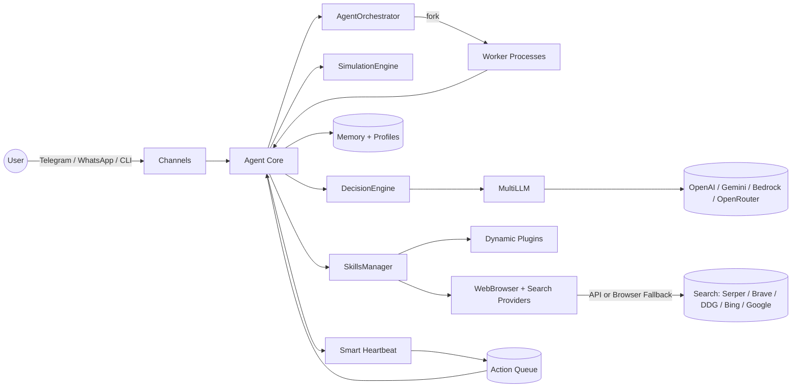

<div align="center">


# OrcBot v2.0
### The Production-Ready Strategic AI Agent
#### High-Power Intelligence with Web, Shell, and Strategic Simulation

[](https://opensource.org/licenses/MIT)
[](https://www.typescriptlang.org/)
[]()
[]()

**Autonomous. Strategic. Multi-Modal. Self-Healing.**

[Features](#features) • [Installation](#installation) • [Quickstart](#quickstart) • [Usage](#-usage) • [Configuration](#configuration) • [Autonomy](#autonomy--heartbeat) • [Skills](#-high-power-skills) • [Plugins](#-dynamic-plugin-system) • [Security](#security--privacy) • [Docs](https://fredabila.github.io/orcbot/docs/)

</div>

---

## 🚀 Why OrcBot v2.0?

OrcBot is a next-generation **autonomous reasoning agent**. In v2.0, we've moved beyond simple ReAct loops to a **Strategic Simulation Architecture**. Before executing a task, OrcBot simulates the outcome, identifies potential pitfalls, and generates a robust execution plan with built-in fallbacks.

### Key Capabilities

*   🧠 **Strategic Simulation Layer**: Pre-task planning that anticipates errors (like CAPTCHAs or search failures) before they happen.
*   🛡️ **Autonomous Immune System**: Automatically detects broken plugin code and uses its `self_repair_skill` to fix itself.
*   ⚙️ **Agent-Driven Config Management**: Intelligent configuration system where agents can safely optimize settings for different tasks while security-critical configs remain protected.
*   📸 **Multi-Modal Intelligence**: Native capability to analyze images, audio, and documents via Telegram and WhatsApp.
*   🌐 **Context-Aware Browsing**: Strategic web navigation that handles dynamic content and bypasses anti-bot measures.
*   🐚 **Shell Execution**: Full system access to run commands, manage files, and install dependencies.
*   💓 **Smart Heartbeat**: Context-aware autonomy with exponential backoff, productivity tracking, and action-oriented tasks.
*   🤖 **Multi-Agent Orchestration**: Spawn worker processes to handle parallel tasks with real-time coordination.
*   🔄 **Termination Review**: Built-in safety layer that reviews proposed actions to prevent premature task termination.
*   🎯 **Smart Skill Routing**: Intent-based skill selection using configurable routing rules for better tool matching.
*   🛤️ **Decision Pipeline**: Guardrails system with deduplication, safety checks, and autopilot mode.
*   🔍 **Resilient Web Search**: Smart fallback from API providers to browser-based search when keys aren't configured.
*   🖥️ **Interactive TUI & Dashboard**: Comprehensive terminal interface with worker process management.
*   🔌 **Dynamic Plugin System**: Hot-loadable TypeScript plugins for limitless extensibility.
*   🔄 **Circuit Breaker Pattern**: Intelligent loop prevention in browser operations to avoid getting stuck.
*   📚 **Self-Updating Identity**: Agent can evolve its personality, values, and operating instructions through bootstrap files.
*   ⏱️ **Event-Driven Polling**: Efficient condition monitoring without busy-waiting loops.

---

## Features

OrcBot is built around **strategic autonomy**: it plans, executes, and repairs itself while staying grounded in your local data and configuration.

---

## Architecture

The system is designed to run locally while integrating with external channels and providers. This diagram shows the core infrastructure flow:



---

## Installation

You can get started instantly with our one-line installer:

**Linux / macOS**
```bash
curl -sSL https://orcbot.ai/install.sh | bash
```

**Windows (PowerShell)**
```powershell
iwr https://orcbot.vercel.app/install.ps1 | iex
```

**Docker (Recommended for servers)**
```bash
# Quick start with Docker Compose
cp .env.example .env  # Edit with your API keys
docker compose -f docker-compose.minimal.yml up -d

# Open dashboard at http://localhost:3100
```

See [Docker Guide](docs/DOCKER.md) for full setup options.

**Manual Installation**
```bash
npm install
npm run build
npm run setup
```

---

## Documentation

Live docs (GitHub Pages): https://fredabila.github.io/orcbot/docs/

**Key Guides:**
*   🌐 [**Browser & Identity Improvements**](BROWSER_IDENTITY_IMPROVEMENTS.md) - Loop prevention, state tracking, self-updating system
*   ⏱️ [**Polling System Guide**](POLLING_USAGE.md) - Event-driven condition monitoring
*   ⚙️ [**Configuration Guide**](docs/CONFIG_MANAGEMENT.md) - Comprehensive configuration management
*   🐳 [**Docker Guide**](docs/DOCKER.md) - Container deployment options
*   📊 [**Testing Guide**](TESTING_GUIDE.md) - Testing strategies and patterns
*   🔒 [**Security Summary**](SECURITY_SUMMARY.md) - Security features and best practices

---

## Quickstart

```bash
# Start the autonomous loop (foreground)
orcbot run

# Start as a background daemon
orcbot run --daemon

# Check daemon status
orcbot daemon status

# Stop the daemon
orcbot daemon stop

# Open the TUI dashboard
orcbot ui

# Push a task immediately
orcbot push "Summarize today’s AI news and save to my journal" -p 10
```

---

## 🕹️ High-Power Skills

OrcBot comes out of the box with "God Mode" capabilities:

| Skill | Description | Usage Example |
|-------|-------------|---------------|
| `run_command` | Execute any shell command | `run_command("npm test")` |
| `web_search` | Search with API + browser fallback | `web_search("latest AI news")` |
| `browser_navigate`| Visit a URL and extract text | `browser_navigate("https://google.com")` |
| `manage_skills` | Install/Update agent skills | `manage_skills("New Skill Definition...")` |
| `deep_reason` | 01-style intensive analysis | `deep_reason("Ethics of AGI")` |
| `update_user_profile`| Permanently learn about user | `update_user_profile("User likes coffee")` |
| `spawn_worker` | Create a worker agent for parallel tasks | `spawn_worker("Research competitor pricing")` |
| `list_workers` | View active worker processes | `list_workers()` |

---

## 🎮 Usage

### TUI Mode (Recommended)
Launch the visual dashboard:
```bash
orcbot ui
```
- **Manage AI Models**: Dedicated menu for OpenAI and Google Gemini keys.
- **Manage Connections**: Configure Telegram and other channels.

### Direct Commands
```bash
# Start the autonomous reasoning loop (foreground)
orcbot run

# Start as a background daemon
orcbot run --daemon

# Check daemon status
orcbot daemon status

# Stop the daemon
orcbot daemon stop

# Push an orchestration task
orcbot push "Find the current price of BTC and message it to Frederick on Telegram" -p 10
```

### Daemon Mode

OrcBot can run as a background daemon, allowing it to operate continuously without keeping a terminal open:

```bash
# Start in daemon mode
orcbot run --daemon
```

When started in daemon mode:
- The process runs in the background and detaches from the terminal
- A PID file is written to `~/.orcbot/orcbot.pid`
- Logs are redirected to `~/.orcbot/daemon.log`
- The daemon will continue running even after you close the terminal

**Managing the daemon:**
```bash
# Check if daemon is running
orcbot daemon status

# Stop the daemon
orcbot daemon stop

# View daemon logs
tail -f ~/.orcbot/daemon.log
```

**Conflict Prevention:**

OrcBot includes built-in safeguards to prevent conflicts between daemon and non-daemon modes:

- Running `orcbot run --daemon` when a daemon is already active will display an error with the existing PID and instructions to stop it first
- Running `orcbot run` (foreground mode) when a daemon is active will prevent startup and suggest stopping the daemon first
- Both modes detect stale PID files (when the process no longer exists) and clean them up automatically
- Clear error messages guide you to use `orcbot daemon stop` or `orcbot daemon status` to manage conflicts

This ensures you won't accidentally run multiple agent instances that could conflict with each other or duplicate channel connections.

---

### Web Gateway

OrcBot provides a web gateway for remote management via REST API and WebSocket:

```bash
# Start the web gateway
orcbot gateway

# Start gateway with agent loop
orcbot gateway --with-agent

# Custom port and API key
orcbot gateway -p 8080 -k mysecretkey

# Serve a dashboard
orcbot gateway -s ./apps/dashboard
```

**API Endpoints:**

| Method | Endpoint | Description |
|--------|----------|-------------|
| GET | `/api/status` | Agent status & info |
| GET | `/api/skills` | List all skills |
| POST | `/api/skills/:name/execute` | Execute a skill |
| POST | `/api/tasks` | Push a new task |
| GET | `/api/tasks` | View task queue |
| GET | `/api/config` | View configuration |
| PUT | `/api/config/:key` | Update config value |
| GET | `/api/memory` | View recent memories |
| GET | `/api/connections` | Channel status |
| GET | `/api/logs` | Recent log entries |
| GET | `/api/security` | Security settings |
| PUT | `/api/security` | Update security settings |

**WebSocket Events:**

Connect to `ws://host:port` for real-time events:
- `status` - Initial agent status
- `event` - Agent events (thinking, action, observation, etc.)
- Actions: `pushTask`, `executeSkill`, `getStatus`, `setConfig`

**Authentication:**

If an API key is configured, include it in requests:
```bash
curl -H "X-Api-Key: yourkey" http://localhost:3100/api/status
```

Configure via TUI (`orcbot ui` → Web Gateway) or config:
```yaml
gatewayPort: 3100
gatewayHost: 0.0.0.0
gatewayApiKey: your-secret-key
```

---

## Configuration

OrcBot reads configuration in this order (highest priority first):

1. Environment variables
2. Local `./orcbot.config.yaml`
3. Home `~/orcbot.config.yaml`
4. Global `~/.orcbot/orcbot.config.yaml`

Key settings (excerpt):

- `modelName`: LLM model to use
- `llmProvider`: Explicit provider selection (`openai`, `google`, `bedrock`, `openrouter`)
- `openrouterApiKey`: API key for OpenRouter (access 200+ models)
- `telegramToken` / `whatsappEnabled`
- `maxStepsPerAction`, `maxMessagesPerAction`, `messageDedupWindow`
- `autonomyEnabled`, `autonomyInterval`, `autonomyBacklogLimit`
- `skillRoutingRules`: Intent-based skill selection rules
- `autopilotNoQuestions`: Skip clarification requests in autopilot mode

You can manage settings via the TUI (`orcbot ui`) or by editing your config file directly.

### Agent-Driven Config Management

OrcBot v2.0 introduces **intelligent configuration management** where agents can automatically optimize settings based on task requirements:

#### Policy-Based Security
- **SAFE configs** (e.g., `modelName`, `memoryContextLimit`): Agents can modify autonomously
- **APPROVAL configs** (e.g., API keys): Agents can request changes, requires human approval
- **LOCKED configs** (e.g., `safeMode`, security settings): Agents cannot modify

#### Autonomous Optimization
Agents intelligently adjust configuration when:
- Code tasks need more capable models (auto-switch to GPT-4)
- Complex tasks require more memory context
- Multi-step workflows need higher step budgets
- LLM provider is unavailable (auto-fallback to alternatives)

#### Usage
```javascript
// Agent can optimize for code tasks
manage_config({ action: "set", key: "modelName", value: "gpt-4", reason: "Code task benefits from GPT-4" })

// Agent can request approval for sensitive changes
manage_config({ action: "set", key: "openaiApiKey", value: "sk-new-key", reason: "API key rotation" })

// View pending approvals
manage_config({ action: "pending" })

// Approve changes
manage_config({ action: "approve", key: "openaiApiKey" })
```

See [Config Management Documentation](docs/CONFIG_MANAGEMENT.md) for complete details.

---

## Autonomy & Smart Heartbeat

OrcBot uses a **smart heartbeat** system that's context-aware and action-oriented:

### Intelligent Scheduling
- **Exponential Backoff**: When unproductive, heartbeat intervals automatically increase (2x, 4x, 8x) to save resources
- **Productivity Tracking**: Measures actual work done vs. idle cycles to optimize timing
- **Context-Aware Actions**: Analyzes recent conversations to determine relevant follow-ups

### Action Types
- **follow_up**: Continue conversations that need closure
- **outreach**: Proactively check in with contacts
- **research**: Learn about topics from recent discussions
- **maintenance**: Journal updates, memory consolidation
- **delegate**: Spawn worker agents for parallel tasks

### Multi-Agent Orchestration
For complex tasks, OrcBot can spawn worker processes:
```bash
# Workers appear in the TUI with PIDs and status
orcbot ui  # → Workers menu shows active processes
```
- Real Node.js child processes via `fork()`
- IPC communication with the main agent
- Shared configuration and isolated execution
- Automatic cleanup on completion

---

---

## 🧠 The Reasoning Loop (ReAct)

OrcBot doesn't just give one answer. It works iteratively:
1.  **THOUGHT**: "I need to find news first."
2.  **ACTION**: Calls `web_search`.
3.  **OBSERVATION**: Receives news results.
4.  **RE-REASON**: "Now I should update the user's profile and then reply."
5.  **FINALIZE**: Completes background tasks and then messages the user.

---

## �️ Decision Pipeline & Safety

OrcBot v2.0 includes a sophisticated decision pipeline that ensures reliable task execution:

### Termination Review Layer
Every proposed action is reviewed before execution to prevent premature task termination. The system favors completing work over asking clarifying questions.

### Skill Routing Rules
Configure intent-based skill selection:
```yaml
skillRoutingRules:
  - intent: "search"
    preferSkills: ["web_search", "browser_navigate"]
  - intent: "code"
    preferSkills: ["run_command", "manage_skills"]
```

### Autopilot Mode
Enable `autopilotNoQuestions: true` to suppress clarification requests and keep the agent moving autonomously.

### Pipeline Guardrails
- **Deduplication**: Prevents repeated tool calls within the same action
- **Safety Checks**: Validates tool parameters and prevents dangerous operations in safe mode
- **Fallback Logic**: Auto-retries with alternative providers on failure

---

## �🔌 Dynamic Plugin System

OrcBot supports hot-loadable skills via TypeScript or JavaScript plugins in `~/.orcbot/plugins` (or `./plugins`).

- **Self-Repair**: If a plugin fails, OrcBot will attempt `self_repair_skill` automatically.
- **Zero restarts**: Plugins are hot-loaded at runtime.

---

## Security & Privacy

- **Local-first**: memory, logs, and profiles stay on your machine
- **No hidden uploads**: network calls only happen when a skill requires them
- **Config isolation**: secrets are loaded from your config and environment variables
- **Safe Mode**: disable command execution and skill creation via `safeMode: true`
- **Plugin allow/deny**: control which plugins can load with `pluginAllowList` and `pluginDenyList`

---

## 🤝 Contributing

OrcBot is built for extensibility. Contributors can add:
- **Skills**: New tools in `src/core/Agent.ts`.
- **Channels**: New communication platforms (Slack, Discord).
- **Providers**: New LLM interfaces in `MultiLLM.ts` (supports OpenAI, Gemini, Bedrock, OpenRouter).

See [CONTRIBUTING.md](CONTRIBUTING.md) for details.

---

<div align="center">
Built with ❤️ for the Autonomous Era
</div>
