<div align="center">


# OrcBot v2.1
### The Production-Ready Strategic AI Agent
#### High-Power Intelligence with Web, Shell, Multi-Channel Delivery, and Strategic Simulation

[](https://opensource.org/licenses/MIT)
[](https://www.typescriptlang.org/)
[]()
[]()
[](https://www.codetriage.com/fredabila/orcbot)

**Autonomous. Strategic. Multi-Modal. Self-Healing.**

[Features](#features) • [Installation](#installation) • [Quickstart](#quickstart) • [Usage](#-usage) • [Configuration](#configuration) • [Autonomy](#autonomy--heartbeat) • [Skills](#-high-power-skills) • [Plugins](#-dynamic-plugin-system) • [Hardware](#hardware--robotics) • [Security](#security--privacy) • [Blog](docs/blog/robotics.md) • [Docs](https://fredabila.github.io/orcbot/docs/)

</div>

---

## 🚀 Why OrcBot v2.1?

OrcBot is a next-generation **autonomous reasoning agent**. Beyond the v2.0 Strategic Simulation Architecture, v2.1 brings hardened skill infrastructure, richer Telegram interactions, a RAG knowledge store, and battle-tested multi-channel delivery.

### Key Capabilities

*   🧠 **Strategic Simulation Layer**: Pre-task planning that anticipates errors (like CAPTCHAs or search failures) before they happen.
*   🛡️ **Autonomous Immune System**: Automatically detects broken plugin code and uses its `self_repair_skill` to fix itself.
*   ⚙️ **Agent-Driven Config Management**: Intelligent configuration system where agents can safely optimize settings for different tasks while security-critical configs remain protected.
*   📸 **Multi-Modal Intelligence**: Native capability to analyze images, audio, and documents via Telegram, WhatsApp, and Discord.
*   🌐 **Context-Aware Browsing**: Strategic web navigation with stealth anti-bot parity across all browser modes, blank-page guards, and search URL save/restore.
*   🐚 **Shell Execution**: Full system access to run commands, manage files, and install dependencies — with reliable Windows process-tree kill and stdout capping.
*   💓 **Smart Heartbeat**: Context-aware autonomy with exponential backoff, productivity tracking, and action-oriented tasks.
*   🤖 **Multi-Agent Orchestration**: Spawn worker processes to handle parallel tasks with real-time coordination.
*   🔄 **Termination Review**: Built-in safety layer that reviews proposed actions to prevent premature task termination.
*   🧭 **LLM Task Complexity**: Dynamic step/message budgets based on model-classified task complexity.
*   🎯 **Smart Skill Routing**: Intent-based skill selection using configurable routing rules for better tool matching.
*   🧩 **Admin Permissions + Known Users**: Elevated skills protected by admin gates with persistent user tracking.
*   🛤️ **Decision Pipeline**: Guardrails system with deduplication, safety checks, and autopilot mode.
*   🔍 **Resilient Web Search**: Smart fallback from API providers to browser-based search when keys aren't configured.
*   🖥️ **Interactive TUI & Dashboard**: Comprehensive terminal interface with worker process management.
*   🔌 **Dynamic Plugin System**: Hot-loadable TypeScript plugins for limitless extensibility.
*   🔄 **Circuit Breaker Pattern**: Intelligent loop prevention in browser operations to avoid getting stuck.
*   📚 **Self-Updating Identity**: Agent can evolve its personality, values, and operating instructions through bootstrap files.
*   ⏱️ **Event-Driven Polling**: Efficient condition monitoring without busy-waiting loops.
*   🎨 **Image Generation**: Built-in skill for generating and delivering images across WhatsApp, Telegram, and Discord.
*   🗃️ **RAG Knowledge Store**: Ingest documents, URLs, and files into a semantic vector search index for durable recall.
*   💬 **Rich Telegram UX**: Inline buttons, polls, message editing, emoji reactions (with reply fallback), and message pinning.
*   🔁 **Clarification Delivery**: `request_supporting_data` now actively sends questions through the active channel before pausing.

---

## Features

OrcBot is built around **strategic autonomy**: it plans, executes, and repairs itself while staying grounded in your local data and configuration.

---

## 📊 Benchmarks & Performance

OrcBot v2.1 is engineered for peak reliability and strategic depth. Our latest benchmark testing shows superior performance across conversational, web, and system tasks.

<div align="center">


**[View Detailed Benchmark Methodology & Data](docs/BENCHMARKS.md)**
</div>

*   **Conversational IQ (9.5/10)**: State-of-the-art context management and complex reasoning.
*   **Task Planning (8.9/10)**: Dynamic simulation that anticipates and bypasses errors.
*   **Web Autonomy (9.2/10)**: Resilient browsing with multi-provider search fallback.
*   **System Resilience (9.7/10)**: Background self-repair and daemon stability.

---

## Architecture

The system is designed to run locally while integrating with external channels and providers. This diagram covers the full v2.1 infrastructure — from inbound channels through the decision stack, memory layers, skills, and external providers.

```mermaid
flowchart TB
    %% ── Inbound ──────────────────────────────────────────────
    subgraph Channels["📡 Channels"]
        TG[Telegram\nTelegraf]
        WA[WhatsApp\nBaileys]
        DC[Discord\ndiscord.js]
        GW[Gateway\nExpress + WS]
    end

    User((👤 User)) -->|message / command| Channels
    CLI[CLI / TUI\norcbot ui] -->|push task| Queue

    %% ── Action Queue ─────────────────────────────────────────
    Channels -->|inbound → short memory\n+ push action| Queue[(🗂️ Action Queue\npriority · retry · TTL\ndependsOn · chaining)]

    %% ── Agent Core ───────────────────────────────────────────
    Queue --> Agent

    subgraph AgentCore["🤖 Agent Core  (Agent.ts)"]
        Agent[Agent\naction loop]
        Sim[SimulationEngine\npre-task plan]
        DE[DecisionEngine\nprompt assembly\n+ LLM call]
        PR[PromptRouter\n8 modular helpers]
        PL[DecisionPipeline\nguardrails · dedup\nloop detection]
        Parser[ParserLayer\n3-tier JSON fallback]
        CC[ContextCompactor\ntruncation + summarise]
        RT[RuntimeTuner\nauto-adjust limits]
        TT[TokenTracker\nper-model cost]
    end

    Agent --> Sim
    Sim --> DE
    DE --> PR
    PR --> DE
    DE --> PL
    PL --> Parser
    Parser --> Agent
    DE <--> CC
    DE --> TT
    Agent --> RT

    %% ── LLM ──────────────────────────────────────────────────
    DE -->|call| LLM[MultiLLM\nrouting + fallback]
    subgraph LLMProviders["🧠 LLM Providers"]
        OAI[OpenAI\ngpt-4o / o1]
        GEM[Google Gemini]
        BED[AWS Bedrock]
        NV[NVIDIA NIM]
        OR[OpenRouter\n200+ models]
    end
    LLM --> OAI & GEM & BED & NV & OR

    %% ── Memory ───────────────────────────────────────────────
    subgraph MemorySystem["🧠 Memory System"]
        MM[MemoryManager]
        SM[short memory\nstep observations]
        EP[episodic memory\nLLM summaries]
        VM[VectorMemory\nembedding index\ntext-embedding-3-small]
        DM[DailyMemory\nappend-only .md logs]
        LM[long memory\nMEMORY.md · LEARNING.md\nUSER.md · JOURNAL.md]
    end
    Agent <--> MM
    MM --> SM & EP & VM & DM & LM
    DE -->|getRecentContext\nsemanticSearch| MM

    %% ── Storage ──────────────────────────────────────────────
    subgraph Storage["💾 Storage"]
        JSON[JSONAdapter\natomic write · .bak · cache]
        SQLite[SQLiteAdapter]
    end
    MM --> JSON
    MM -.-> SQLite

    %% ── Skills ───────────────────────────────────────────────
    Agent -->|execute tools| Skills

    subgraph SkillLayer["⚙️ Skills"]
        SM2[SkillsManager\nregistry · intent routing]
        CoreSkills["Core Skills\nweb_search · browser_navigate\nhttp_fetch · extract_article\ndownload_file · read_file · write_file\nsend_file · send_voice_note · send_image\ntelegram_send_buttons · telegram_send_poll\ntelegram_react · telegram_edit/pin\nschedule_task · heartbeat_schedule\nrun_command · deep_reason\nrecall_memory · update_user_profile\nupdate_learning · request_supporting_data\nrag_ingest/search/list/delete\nspawn_agent · delegate_task\nmanage_config · system_check\nself_repair_skill · create_custom_skill"]
        Plugins[Dynamic Plugins\n~/.orcbot/plugins/\nhot-loaded · self-repair]
    end
    Skills --> SM2
    SM2 --> CoreSkills & Plugins

    %% ── Browser + Search ─────────────────────────────────────
    CoreSkills --> Browser[WebBrowser\nPlaywright stealth\nblank-page guard\n2Captcha]
    Browser -->|search fallback chain| Search[(Serper → Google\n→ Bing → DDG)]

    %% ── Config ───────────────────────────────────────────────
    subgraph Config["⚙️ Config"]
        CM[ConfigManager\nYAML hot-reload\nfeature toggles]
        CP[ConfigPolicy\nSAFE / APPROVAL / LOCKED]
    end
    Agent --> CM
    CM --> CP

    %% ── Scheduler / Orchestrator ─────────────────────────────
    Sched[Scheduler\ncroner · EventBus ticks] -->|scheduler:tick| Queue
    Agent --> Sched

    Orch[AgentOrchestrator] -->|fork| Workers[Worker Processes\nisolated · IPC]
    Workers -->|results| Agent
    Agent --> Orch

    %% ── Outbound delivery ────────────────────────────────────
    CoreSkills -->|3-tier channel detection\nWhatsApp → Discord → Telegram| Channels
```



---

## Hardware & Robotics

OrcBot is software-first, but its skill system makes it a strong brain for hardware stacks. The recommended pattern is to keep **real-world control in a dedicated hardware bridge** (ROS2, MQTT, REST, or serial gateway), and let OrcBot plan, reason, and issue safe commands through that bridge.

**Reference architecture:**
- **OrcBot Core**: planning, memory, autonomy, and decision pipeline.
- **Hardware Bridge Service**: a small service that translates high-level intents into robot-specific commands.
- **Message Bus**: ROS2 topics, MQTT, or a REST endpoint to decouple AI from actuators.
- **Safety Layer**: rate limits, e-stop, and command validation before hitting motors.

**How OrcBot supports it:**
- Skills can call HTTP endpoints, shell scripts, or custom plugins to control hardware.
- The autonomy loop and heartbeat can schedule inspections, patrols, or checks.
- The decision pipeline guards against loops and invalid actions before they reach actuators.

For a full walkthrough and example integration plan, see the blog: [Robotics + OrcBot](docs/blog/robotics.md).

---

## Installation

You can get started instantly with our one-line installer:

**Linux / macOS**
```bash
curl -sSL https://orcbot.ai/install.sh | bash
```

**Windows (PowerShell)**
```powershell
iwr https://orcbot.vercel.app/install.ps1 | iex
```

**Docker (Recommended for servers)**
```bash
# Quick start with Docker Compose
cp .env.example .env  # Edit with your API keys
docker compose -f docker-compose.minimal.yml up -d

# Open dashboard at http://localhost:3100
```

See [Docker Guide](docs/DOCKER.md) for full setup options.

**Manual Installation**
```bash
npm install
npm run build
npm run setup
```

---

## Documentation

Live docs (GitHub Pages): https://fredabila.github.io/orcbot/docs/

**Key Guides:**
*   🌐 [**Browser & Identity Improvements**](BROWSER_IDENTITY_IMPROVEMENTS.md) - Loop prevention, state tracking, self-updating system
*   ⏱️ [**Polling System Guide**](POLLING_USAGE.md) - Event-driven condition monitoring
*   ⚙️ [**Configuration Guide**](docs/CONFIG_MANAGEMENT.md) - Comprehensive configuration management
*   🐳 [**Docker Guide**](docs/DOCKER.md) - Container deployment options
*   📊 [**Testing Guide**](TESTING_GUIDE.md) - Testing strategies and patterns
*   🔒 [**Security Summary**](SECURITY_SUMMARY.md) - Security features and best practices
*   🚀 [**Extraordinary Use Cases**](docs/EXTRAORDINARY_USE_CASES.md) - God-mode automation, robotics, and strategic orchestration
*   🤖 [**Robotics + OrcBot**](docs/blog/robotics.md) - Hardware integration approach and safety patterns

---

## Quickstart

```bash
# Start the autonomous loop (foreground)
orcbot run

# Start as a background daemon
orcbot run --daemon

# Check daemon status
orcbot daemon status

# Stop the daemon
orcbot daemon stop

# Open the TUI dashboard
orcbot ui

# Push a task immediately
orcbot push "Summarize today’s AI news and save to my journal" -p 10
```

---

## 🕹️ High-Power Skills

OrcBot comes out of the box with "God Mode" capabilities:

| Skill | Description | Usage Example |
|-------|-------------|---------------|
| `run_command` | Execute shell commands (PowerShell on Windows). Stdout capped at 8 KB; process tree forcefully killed on timeout. | `run_command("npm test")` |
| `web_search` | Search with API + browser fallback | `web_search("latest AI news")` |
| `browser_navigate` | Visit a URL and extract text | `browser_navigate("https://google.com")` |
| `http_fetch` | Lightweight HTTP GET/POST/PUT without browser | `http_fetch("https://api.example.com/data")` |
| `extract_article` | Extract clean article text via Readability | `extract_article("https://news.example.com/article")` |
| `download_file` | Download file with 60 s timeout, 50 MB cap, MIME→extension inference | `download_file("https://example.com/report.pdf")` |
| `read_file` | Read file with optional line range (start_line/end_line), 20 KB cap | `read_file("/path/to/file.md", 1, 100)` |
| `write_file` | Write/append to file, 10 MB size guard | `write_file("/path/output.md", "content")` |
| `send_file` | Send file via WhatsApp, Telegram, or Discord (auto-detected) | `send_file("123456", "/path/img.png", channel="discord")` |
| `send_voice_note` | TTS → voice note. Discord fallback: audio file attachment | `send_voice_note("user@s.whatsapp.net", "Hello!")` |
| `send_image` | Generate AI image and send in one step | `send_image("user_id", "a futuristic city", channel="telegram")` |
| `text_to_speech` | Convert text to .ogg/wav audio file | `text_to_speech("Hello world", voice="nova" [OAI] or "kore" [Google])` |
| `manage_skills` | Append skill definition to SKILLS.md | `manage_skills("New Skill Definition...")` |
| `create_skill` | Create a knowledge-based SKILL.md skill | `create_skill("pdf-processor", "Parse PDFs")` |
| `create_custom_skill` | Create an executable TypeScript plugin skill | `create_custom_skill("stripe-charge", "Charge via Stripe")` |
| `execute_typescript` | Write, compile, and execute a free-form TS scratchpad | `execute_typescript("console.log('hi');")` |
| `deep_reason` | Intensive chain-of-thought analysis | `deep_reason("Ethics of AGI")` |
| `update_user_profile` | Permanently persist user preferences and facts | `update_user_profile("User prefers concise answers")` |
| `update_learning` | Research topic and save findings to LEARNING.md | `update_learning("WebAssembly 2025")` |
| `recall_memory` | Semantic search across all memory types | `recall_memory("last deployment discussion")` |
| `rag_ingest` | Ingest document into RAG vector knowledge store | `rag_ingest(content, "report.md")` |
| `rag_search` | Semantic search across ingested knowledge | `rag_search("deployment checklist")` |
| `rag_ingest_url` | Fetch URL and ingest into knowledge store | `rag_ingest_url("https://docs.example.com")` |
| `schedule_task` | One-off task scheduling (relative or cron) | `schedule_task("in 2 hours", "Send daily report")` |
| `heartbeat_schedule` | Recurring cron-based autonomous tasks | `heartbeat_schedule("0 9 * * 1-5", "Morning brief")` |
| `spawn_agent` | Create a named sub-agent for parallel work | `spawn_agent("researcher", "worker")` |
| `delegate_task` | Create and assign task to agent or orchestrator | `delegate_task("Scrape pricing page", 5)` |
| `request_supporting_data` | Send a question to user through active channel and pause | `request_supporting_data("Which region?")` |
| `telegram_send_buttons` | Send Telegram message with inline keyboard buttons | `telegram_send_buttons(chatId, "Choose:", [["A", "B"]])` |
| `telegram_send_poll` | Send a Telegram poll | `telegram_send_poll(chatId, "Preference?", ["Yes","No"])` |
| `telegram_react` | React with emoji; falls back to reply if native reactions blocked | `telegram_react(chatId, msgId, "👍")` |
| `telegram_edit_message` | Edit a previously sent Telegram message | `telegram_edit_message(chatId, msgId, "Updated text")` |
| `telegram_pin_message` | Pin a message in a Telegram chat | `telegram_pin_message(chatId, msgId)` |
| `get_system_info` | Get platform, OS, Node version, shell, and command guidance | `get_system_info()` |
| `system_check` | Verify commands, shared libraries, and file paths exist | `system_check(["node","git"], [], ["/etc/hosts"])` |

---

## 🎮 Usage

### TUI Mode (Recommended)
Launch the visual dashboard:
```bash
orcbot ui
```
- **Manage AI Models**: Dedicated menu for OpenAI and Google Gemini keys.
- **Manage Connections**: Configure Telegram and other channels.
- **Gateway + Tailscale Guidance**: `Web Gateway` menu now includes a `Tailscale Setup & Status Guide` flow with checks and recommended hardening steps.

### Direct Commands
```bash
# Start the autonomous reasoning loop (foreground)
orcbot run

# Start as a background daemon
orcbot run --daemon

# Check daemon status
orcbot daemon status

# Stop the daemon
orcbot daemon stop

# Push an orchestration task
orcbot push "Find the current price of BTC and message it to Frederick on Telegram" -p 10
```

### Daemon Mode

OrcBot can run as a background daemon, allowing it to operate continuously without keeping a terminal open:

```bash
# Start in daemon mode
orcbot run --daemon
```

When started in daemon mode:
- The process runs in the background and detaches from the terminal
- A PID file is written to `~/.orcbot/orcbot.pid`
- Logs are redirected to `~/.orcbot/daemon.log`
- The daemon will continue running even after you close the terminal

**Managing the daemon:**
```bash
# Check if daemon is running
orcbot daemon status

# Stop the daemon
orcbot daemon stop

# View daemon logs
tail -f ~/.orcbot/daemon.log
```

**Conflict Prevention:**

OrcBot includes built-in safeguards to prevent conflicts between daemon and non-daemon modes:

- Running `orcbot run --daemon` when a daemon is already active will display an error with the existing PID and instructions to stop it first
- Running `orcbot run` (foreground mode) when a daemon is active will prevent startup and suggest stopping the daemon first
- Both modes detect stale PID files (when the process no longer exists) and clean them up automatically
- Clear error messages guide you to use `orcbot daemon stop` or `orcbot daemon status` to manage conflicts

This ensures you won't accidentally run multiple agent instances that could conflict with each other or duplicate channel connections.

---

### Web Gateway

OrcBot provides a web gateway for remote management via REST API and WebSocket:

```bash
# Start the web gateway
orcbot gateway

# Start gateway with agent loop
orcbot gateway --with-agent

# Custom port and API key
orcbot gateway -p 8080 -k mysecretkey

# Serve a dashboard
orcbot gateway -s ./apps/dashboard
```

**API Endpoints:**

| Method | Endpoint | Description |
|--------|----------|-------------|
| GET | `/api/status` | Agent status & info |
| GET | `/api/skills` | List all skills |
| POST | `/api/skills/:name/execute` | Execute a skill |
| POST | `/api/tasks` | Push a new task |
| GET | `/api/tasks` | View task queue |
| GET | `/api/config` | View configuration |
| PUT | `/api/config/:key` | Update config value |
| GET | `/api/memory` | View recent memories |
| GET | `/api/connections` | Channel status |
| GET | `/api/logs` | Recent log entries |
| GET | `/api/security` | Security settings |
| PUT | `/api/security` | Update security settings |

**WebSocket Events:**

Connect to `ws://host:port` for real-time events:
- `status` - Initial agent status
- `event` - Agent events (thinking, action, observation, etc.)
- Actions: `pushTask`, `executeSkill`, `getStatus`, `setConfig`

**Authentication:**

If an API key is configured, include it in requests:
```bash
curl -H "X-Api-Key: yourkey" http://localhost:3100/api/status
```

Configure via TUI (`orcbot ui` → Web Gateway) or config:
```yaml
gatewayPort: 3100
gatewayHost: 0.0.0.0
gatewayApiKey: your-secret-key
```

**Recommended for remote access: Tailscale (private mesh network)**
- Keep the gateway private to your Tailnet instead of exposing port 3100 publicly.
- Still set `gatewayApiKey` for defense-in-depth.
- Restrict access with Tailnet ACLs to trusted operators/devices only.

---

## Configuration

OrcBot reads configuration in this order (highest priority first):

1. Environment variables
2. Local `./orcbot.config.yaml`
3. Home `~/orcbot.config.yaml`
4. Global `~/.orcbot/orcbot.config.yaml`

Key settings (excerpt):

- `modelName`: LLM model to use
- `llmProvider`: Explicit provider selection (`openai`, `google`, `bedrock`, `openrouter`)
- `openrouterApiKey`: API key for OpenRouter (access 200+ models)
- `telegramToken` / `whatsappEnabled`
- `maxStepsPerAction`, `maxMessagesPerAction`, `messageDedupWindow`
- `autonomyEnabled`, `autonomyInterval`, `autonomyBacklogLimit`
- `autonomyAllowedChannels`: List of channels the agent can message proactively (e.g., `["telegram"]`).
- `skillRoutingRules`: Intent-based skill selection rules
- `reasoningExposeChecklist`: Set to `true` to send the agent's internal step-by-step checklist to the user before starting complex tasks.

### Autonomy Channel Policy
To prevent background spam, the agent uses `autonomyAllowedChannels` to restrict where it can send "out of the blue" updates.
*   **Direct Responses:** Always allowed. If you message the bot, it can always reply on that same channel.
*   **Proactive Updates:** Only allowed on channels listed in `autonomyAllowedChannels`.
*   **Default:** Empty `[]` (Silent in background).

Example config:
```yaml
autonomyAllowedChannels:
  - telegram
  - discord
```

### Agent-Driven Config Management

OrcBot v2.0 introduces **intelligent configuration management** where agents can automatically optimize settings based on task requirements:

#### Policy-Based Security
- **SAFE configs** (e.g., `modelName`, `memoryContextLimit`): Agents can modify autonomously
- **APPROVAL configs** (e.g., API keys): Agents can request changes, requires human approval
- **LOCKED configs** (e.g., `safeMode`, security settings): Agents cannot modify

#### Autonomous Optimization
Agents intelligently adjust configuration when:
- Code tasks need more capable models (auto-switch to GPT-4)
- Complex tasks require more memory context
- Multi-step workflows need higher step budgets
- LLM provider is unavailable (auto-fallback to alternatives)

#### Usage
```javascript
// Agent can optimize for code tasks
manage_config({ action: "set", key: "modelName", value: "gpt-4", reason: "Code task benefits from GPT-4" })

// Agent can request approval for sensitive changes
manage_config({ action: "set", key: "openaiApiKey", value: "sk-new-key", reason: "API key rotation" })

// View pending approvals
manage_config({ action: "pending" })

// Approve changes
manage_config({ action: "approve", key: "openaiApiKey" })
```

See [Config Management Documentation](docs/CONFIG_MANAGEMENT.md) for complete details.

---

## Autonomy & Smart Heartbeat

OrcBot uses a **smart heartbeat** system that's context-aware and action-oriented:

### Intelligent Scheduling
- **Exponential Backoff**: When unproductive, heartbeat intervals automatically increase (2x, 4x, 8x) to save resources
- **Productivity Tracking**: Measures actual work done vs. idle cycles to optimize timing
- **Context-Aware Actions**: Analyzes recent conversations to determine relevant follow-ups

### Action Types
- **follow_up**: Continue conversations that need closure
- **outreach**: Proactively check in with contacts
- **research**: Learn about topics from recent discussions
- **maintenance**: Journal updates, memory consolidation
- **delegate**: Spawn worker agents for parallel tasks

### Completion Audit Codes (Troubleshooting)
When OrcBot blocks premature completion, logs include a compact code like `AUDIT_BLOCK:ACK_ONLY+UNSENT_RESULTS`.

| Code | Meaning | Typical Fix |
|------|---------|-------------|
| `NO_SEND` | No user-visible reply was sent for a channel task | Ensure a channel send skill is called before completion |
| `UNSENT_RESULTS` | Deep tool output exists after the last sent message | Send a final results message after search/browser/command steps |
| `NO_SUBSTANTIVE` | Deep/research tools ran, but no substantive delivery was sent | Replace status updates with concrete findings/outcomes |
| `ACK_ONLY` | Only acknowledgement/status-style messages were sent | Follow ack with one content-rich delivery message |
| `ERROR_UNRESOLVED` | Tool errors occurred without a substantive recovery/result message | Explain failure + next step, or retry with an alternate strategy |
| `GENERIC` | Fallback classification for uncategorized audit issue | Inspect action step memories and recent pipeline notes |

You can view these in daemon logs and in the action's short memory entries (look for `completion-audit-blocked`).

### Multi-Agent Orchestration
For complex tasks, OrcBot can spawn worker processes:
```bash
# Workers appear in the TUI with PIDs and status
orcbot ui  # → Workers menu shows active processes
```
- Real Node.js child processes via `fork()`
- IPC communication with the main agent
- Shared configuration and isolated execution
- Automatic cleanup on completion

---

---

## 🧠 The Reasoning Loop (ReAct)

OrcBot doesn't just give one answer. It works iteratively:
1.  **THOUGHT**: "I need to find news first."
2.  **ACTION**: Calls `web_search`.
3.  **OBSERVATION**: Receives news results.
4.  **RE-REASON**: "Now I should update the user's profile and then reply."
5.  **FINALIZE**: Completes background tasks and then messages the user.

---

## 🛡️ Decision Pipeline & Safety

OrcBot v2.0 includes a sophisticated decision pipeline that ensures reliable task execution:

### Termination Review Layer
Every proposed action is reviewed before execution to prevent premature task termination. The system favors completing work over asking clarifying questions.

### Task Complexity Classifier
OrcBot uses an LLM-based classifier to label tasks as trivial, simple, standard, or complex. This drives step and message budgets dynamically instead of brittle regex rules.

### Skill Routing Rules
Configure intent-based skill selection:
```yaml
skillRoutingRules:
  - intent: "search"
    preferSkills: ["web_search", "browser_navigate"]
  - intent: "code"
    preferSkills: ["run_command", "manage_skills"]
```

### Autopilot Mode
Enable `autopilotNoQuestions: true` to suppress clarification requests and keep the agent moving autonomously.

### Pipeline Guardrails
- **Deduplication**: Prevents repeated tool calls within the same action
- **Safety Checks**: Validates tool parameters and prevents dangerous operations in safe mode
- **Fallback Logic**: Auto-retries with alternative providers on failure
- **Information Boundaries**: Non-admin tasks are blocked from journal/learning/episodic context to prevent cross-user leakage

---

## 🔌 Dynamic Plugin System

OrcBot supports hot-loadable skills via TypeScript or JavaScript plugins in `~/.orcbot/plugins` (or `./plugins`).

- **Self-Repair**: If a plugin fails, OrcBot will attempt `self_repair_skill` automatically.
- **Zero restarts**: Plugins are hot-loaded at runtime.

---

## Security & Privacy

- **Local-first**: memory, logs, and profiles stay on your machine
- **No hidden uploads**: network calls only happen when a skill requires them
- **Config isolation**: secrets are loaded from your config and environment variables
- **Safe Mode**: disable command execution and skill creation via `safeMode: true`
- **Plugin allow/deny**: control which plugins can load with `pluginAllowList` and `pluginDenyList`
- **Admin-only Skills**: elevated capabilities are gated to configured admins

---

## What's New in v2.1

### Skill Infrastructure Hardening
- **`download_file`**: 60 s timeout, 50 MB streaming cap, MIME → file extension inference, uses `dataHome` directory.
- **`send_file` / `send_voice_note`**: Full 3-tier channel detection (WhatsApp → Discord → Telegram) using action source metadata and JID snowflake pattern. Discord voice notes send as audio file attachments.
- **`read_file`**: `start_line` / `end_line` parameters for pagination; limit raised from 10 KB to 20 KB.
- **`write_file`**: 10 MB content guard prevents accidental large writes.
- **`run_command`**: Reliable Windows process-tree kill via `taskkill /PID … /T /F`; stdout capped at 8 KB with tail-hint.
- **`request_supporting_data`**: Now actively sends the question through the originating channel before returning the pause sentinel.
- **`update_learning`**: LLM extraction input capped at 3 000 chars; per-entry storage capped at 3 000 chars to prevent LEARNING.md bloat.

### Telegram Rich UX
- Inline keyboard buttons (`telegram_send_buttons`)
- Native polls (`telegram_send_poll`)
- Emoji reactions with graceful reply fallback (`telegram_react`)
- Message editing (`telegram_edit_message`)
- Message pinning (`telegram_pin_message`)

### Browser Infrastructure
- `navigateEphemeral` now has full anti-bot stealth parity with main browser.
- `searchGoogle` / `searchBing` / `searchDuckDuckGo` save/restore `lastNavigatedUrl` so browser context is not clobbered by background searches.
- `extract_article` reuses the shared Playwright browser instead of spawning a new process.
- Blank-page counter now tracked on the fast `extractContent` path.
- Search cache hits no longer append `[cache]` suffix into LLM output.

### RAG Knowledge Store
- `rag_ingest`, `rag_ingest_file`, `rag_ingest_url`, `rag_search`, `rag_list`, `rag_delete`
- Chunk-based embedding storage with collection namespacing and tag filtering.
- Automatic HTML→Readability extraction in `rag_ingest_url`.

---

## 🤝 Contributing

OrcBot is built for extensibility. Contributors can add:
- **Skills**: New tools in `src/core/Agent.ts`.
- **Channels**: New communication platforms (Slack, Discord).
- **Providers**: New LLM interfaces in `MultiLLM.ts` (supports OpenAI, Gemini, Bedrock, OpenRouter).

See [CONTRIBUTING.md](CONTRIBUTING.md) for details.

---

<div align="center">
Built with ❤️ for the Autonomous Era
</div>
